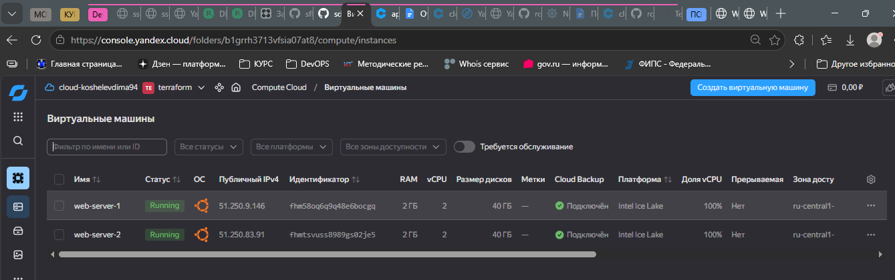
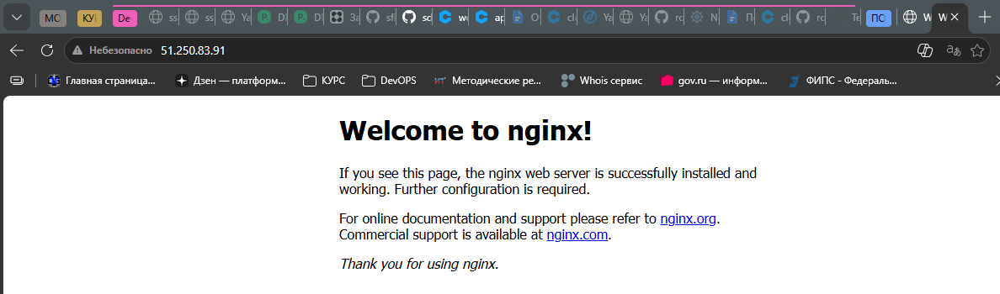
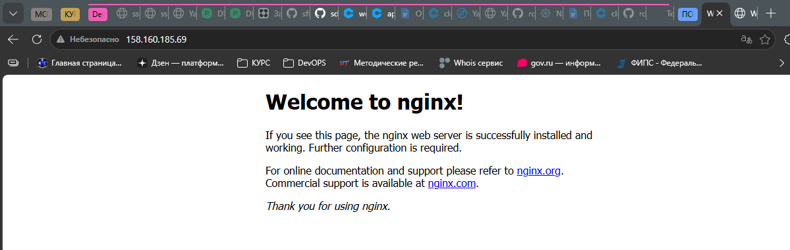
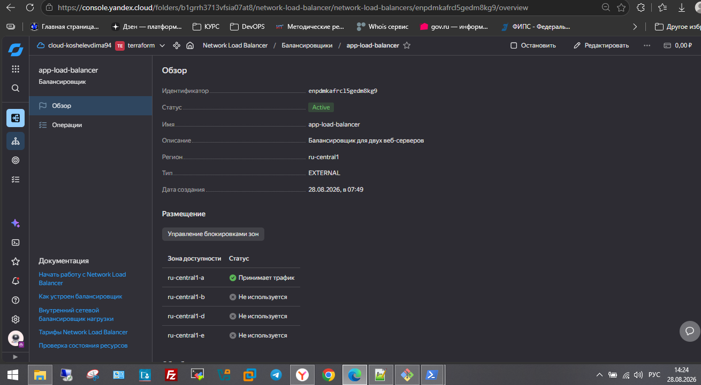
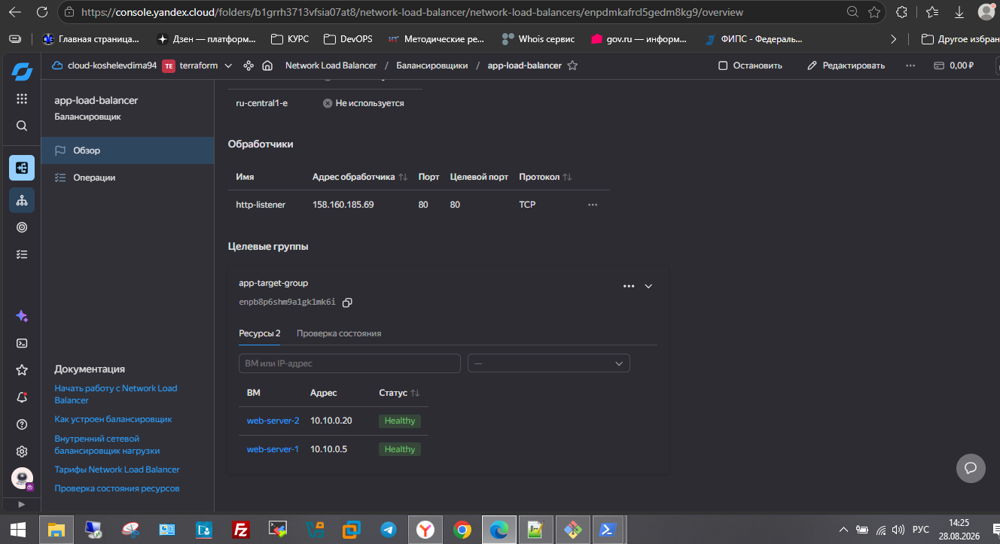

# Домашнее задание к занятию "Отказоустойчивость в облаке" - `Кошелев Дмитрий Владимирович`

  
---

### Задание 1

# Домашнее задание: Развертывание инфраструктуры в Yandex Cloud с балансировщиком

## Задание 1: Развертывание VPC, двух веб-серверов и сетевого балансировщика

### Описание задания
Создана инфраструктура в Yandex Cloud, включающая:
- Виртуальную сеть (VPC) с подсетью
- Две идентичные виртуальные машины с веб-сервером Nginx
- Целевую группу для балансировщика
- Сетевой балансировщик нагрузки с проверкой состояния (Health Check)

### Выполненные шаги

1. **Создание облачной сети и подсети:**
   - Создана VPC сеть `app-network` с CIDR `10.10.0.0/24`
   - Создана подсеть `app-subnet` в зоне `ru-central1-a`

2. **Создание виртуальных машин:**
   - Созданы две ВМ: `web-server-1` и `web-server-2`
   - Использован образ Ubuntu 22.04 LTS
   - Назначены публичные IP-адреса для доступа из интернета
   - Настроен SSH-доступ через ED25519 ключ

3. **Установка и настройка Nginx:**
   - На обе ВМ установлен веб-сервер Nginx
   - Сервис добавлен в автозагрузку
   - Проверена доступность через публичные IP-адреса

4. **Создание целевой группы:**
   - Создана целевая группа `app-target-group`
   - В группу добавлены обе ВМ с их внутренними IP-адресами
   - Настроена проверка состояния (Health Check) на порт 80

5. **Создание сетевого балансировщика:**
   - Создан внешний балансировщик `app-load-balancer`
   - Настроен обработчик (listener) на порт 80
   - Трафик направляется на целевой порт 80 ВМ
   - Настроена HTTP-проверка состояния по пути `/`

https://github.com/rooot-root/40_dz_cloud/blob/main/main.tf

При необходимости прикрепитe сюда скриншоты
;
;
;
;
;

